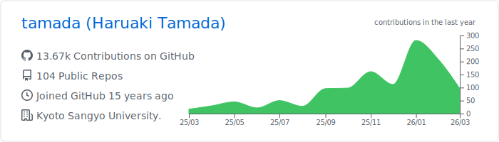
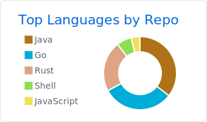
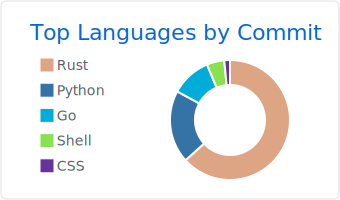
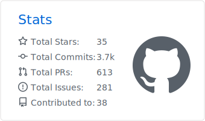
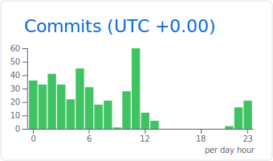

# Haruaki Tamada 

## SNSs

### General SNS

### Developers' SNS

### Researchers' SNS

### Misc

## Development Profile

### Skill Icons [🔗](https://skillicons.dev)

### Profile Summary

 
 

### GitHub Stats

### Trophies

